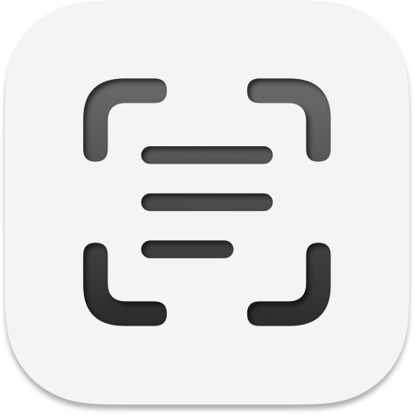

# LaTeX OCR



[](https://github.com/SamuelZ12/LaTeX-OCR/releases/latest)
[](https://github.com/SamuelZ12/LaTeX-OCR/releases)
[](LICENSE)
[](https://github.com/SamuelZ12/LaTeX-OCR/releases/latest)

A macOS menu bar application for capturing screen regions and extracting content using AI-powered prompts. Features built-in support for LaTeX and Markdown extraction, plus the ability to create your own custom prompts.

## Demo

Watch the application in action:


### Menu Bar Access


### Settings Panel


## Features

* **Menu Bar Convenience:** Lives in your menu bar for quick access.
* **Screen Capture:** Use global keyboard shortcuts or the menu bar to capture any portion of your screen.
* **Text Extraction (Vision OCR):** Uses Apple's built-in Vision framework for fast, offline text recognition.
* **AI-Powered Extraction:** Leverages the Google Gemini API with customizable prompts for intelligent content extraction.
* **Built-in Prompts:**
  * **LaTeX:** Convert mathematical equations and formatted content to LaTeX code.
  * **Markdown:** Extract and convert content to clean Markdown format.
* **Custom Prompts:** Create, edit, and save your own prompts for specialized extraction needs.
* **Per-Prompt Output Format:** Configure how each prompt formats output (line breaks, spaces, or LaTeX newlines).
* **Default Prompt:** Set any prompt as the default for quick keyboard access.
* **Gemini Model Selection:** Choose between different Gemini models to optimize for speed, cost, or accuracy.
* **Clipboard Integration:** Automatically copies extracted content to your clipboard.
* **Customizable Shortcuts:** Set global keyboard shortcuts for text extraction and your default prompt.
* **Recent History:** Access recently captured results directly from the menu bar.
* **API Key Management:** Securely enter and store your Google Gemini API key via the Settings panel.

## Requirements

* **macOS:** Version 14.0 (Sonoma) or later.
* **Google Gemini API Key:** Required for AI-powered extraction (LaTeX, Markdown, and custom prompts). Get a free key from [Google AI Studio](https://makersuite.google.com/app/apikey).
* **Xcode:** Version 16.0 or later (if building from source).

## Gemini API Models and Rate Limits

LaTeX OCR allows you to choose between the following Gemini models to optimize for your specific needs:

| Model | Description |
|-------|-------------|
| **Gemini 3 Flash** | Best balance of speed, cost, and accuracy |
| **Gemini 3 Pro** | Most capable model for complex content |
| **Gemini 2.5 Flash-Lite** | Fastest and most cost-effective option |

> Note: All models are available on the free tier that includes a generous [usage limit](https://ai.google.dev/gemini-api/docs/rate-limits) that should be more than sufficient for personal use.

## Installation

### Quick Install

1. **Download** the latest `.dmg` from [Releases](https://github.com/SamuelZ12/LaTeX-OCR/releases/latest)
2. **Open** the DMG and drag LaTeX OCR to Applications
3. **Right-click** the app and select "Open" (required for first launch)

### Opening for the First Time

Since this app is not notarized with Apple, macOS will show a security warning. Here's how to open it:

**Option 1: Right-click to Open (Recommended)**
1. Open Finder and go to Applications
2. Right-click (or Control-click) on LaTeX OCR
3. Select "Open" from the context menu
4. Click "Open" in the dialog that appears

**Option 2: System Settings**
1. Try to open the app normally (it will be blocked)
2. Go to **System Settings > Privacy & Security**
3. Scroll down to find the message about LaTeX OCR being blocked
4. Click "Open Anyway"

> This only needs to be done once. After the first successful launch, the app will open normally.

### First Launch

When you first open LaTeX OCR, a setup wizard will guide you through:
1. **Screen Recording Permission** - Required for screen capture functionality
2. **API Key Setup** - Optional, enables AI-powered extraction (LaTeX, Markdown, custom prompts)

The app will appear in your menu bar after setup is complete.

## Usage

**Capture:**
* Click the menu bar icon and select "Extract Text" for offline OCR, or choose a prompt (LaTeX, Markdown, or custom)
* Use keyboard shortcuts: **Cmd+T** for text, **Cmd+L** for your default AI prompt

**Select Area:** Your cursor will turn into a crosshair. Click and drag to select the screen region.

**Result:**
* A sound plays on successful capture
* Content is automatically copied to your clipboard
* Menu bar icon briefly shows a checkmark

**History:** Access recent captures from the menu bar under "Recent Captures"

**Settings:**
* **API Key:** Enter your Google Gemini API Key for AI-powered extraction
* **Gemini Model:** Select your preferred model (speed vs. accuracy trade-off)
* **Shortcuts:** Customize keyboard shortcuts
* **Prompts:** Create custom prompts, edit copy formats, set your default

## Custom Prompts

Create your own prompts for specialized extraction:

1. Open **Settings** from the menu bar.
2. In the **Prompts** section, click the **+** button.
3. Enter a name and write your prompt instructions.
4. Choose your preferred copy format (line breaks, spaces, or LaTeX newlines).
5. Click **Create** to save.

You can set any prompt as your default by selecting it and clicking **Set as Default**. The default prompt will be triggered by the keyboard shortcut (Cmd+L by default).

**Note:** Built-in prompts (LaTeX and Markdown) cannot be deleted or have their content modified, but you can change their copy format.

## Building from Source

If you prefer to build the application yourself:

1.  **Clone the repository:**
    ```bash
    git clone https://github.com/SamuelZ12/LaTeX-OCR.git
    cd LaTeX-OCR
    ```
2.  **Open in Xcode:**
    ```bash
    open LaTeXOCR.xcodeproj
    ```
3.  **Select Scheme:** Ensure the `LaTeXOCR` scheme is selected.
4.  **Build/Run:** Press `Cmd+B` to build or `Cmd+R` to run the application directly on your Mac. (Apps you build yourself typically don't trigger the same Gatekeeper warnings on your own machine).
5.  **(Required for AI extraction)** **Configure API Key and Model:** After running the built app, open its Settings panel from the menu bar icon, enter your Google Gemini API key, and select your preferred model.

## Code Structure Overview

* `LaTeXOCR/Sources/App.swift`: Main application delegate, menu bar setup, capture initiation, and result handling.
* `LaTeXOCR/Sources/Recognizer.swift`: Handles text OCR using Apple's Vision framework.
* `LaTeXOCR/Sources/Models/Prompt.swift`: Prompt data model with built-in LaTeX and Markdown prompts.
* `LaTeXOCR/Sources/Services/GeminiService.swift`: Manages interaction with the Google Gemini API.
* `LaTeXOCR/Sources/Services/PromptManager.swift`: CRUD operations for prompts and persistence.
* `LaTeXOCR/Sources/Settings/`: Contains SwiftUI views for settings and prompt management.
* `LaTeXOCR/Sources/Extensions/`: Utility extensions for various AppKit/Foundation classes.
* `LaTeXOCR/Info.plist`: Application metadata and permission descriptions.
* `LaTeXOCR.xcodeproj`: Xcode project file.

## License

This project is licensed under the MIT License - see the [LICENSE](LICENSE) file for details.

## Acknowledgments

Built on top of [TextGrabber2](https://github.com/TextGrabber2-app/TextGrabber2) by cyanzhong
